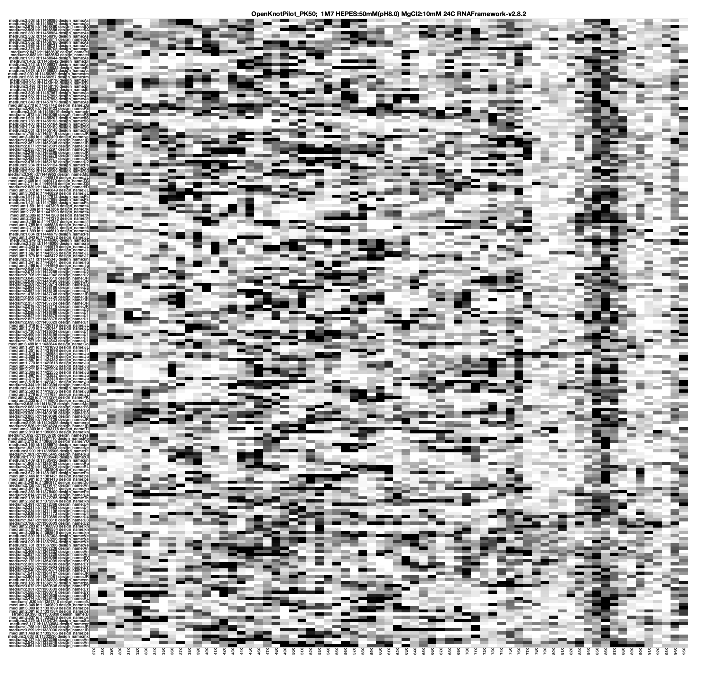
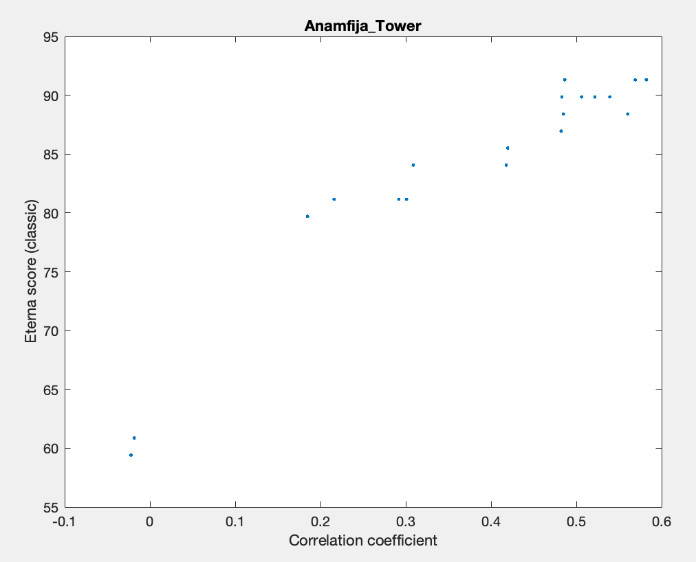
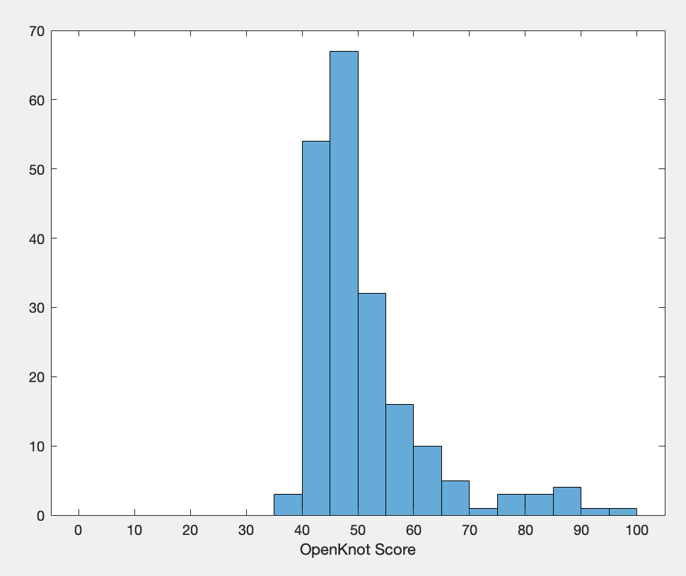
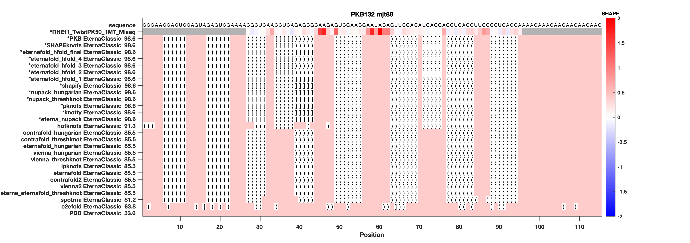
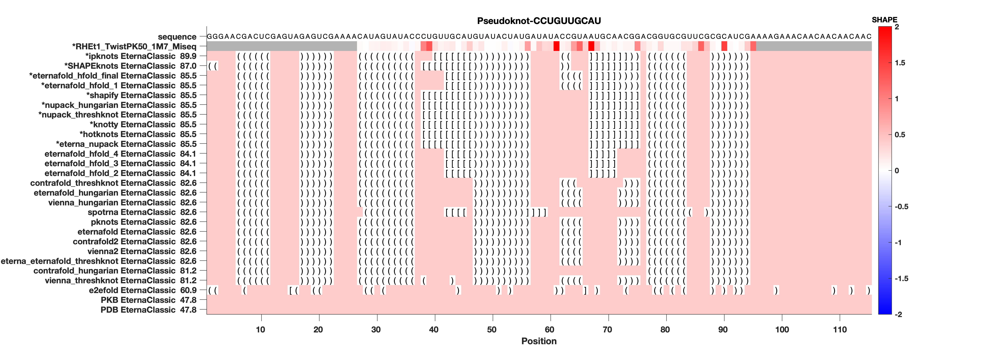

# OpenKnotScore
Scripts and examples for scoring pseudoknot designs based on chemical mapping data.

Developed for the Eterna project's [OpenKnot challenge](https://eternagame.org/challenges/11843006) by R. Das.

Thanks to Rachael Kretsch, Grace Nye, Thomas Karagianes, Rui Huang, Jill Townley, Jonathan Romano, and the Eterna developer team for comments, data, and preliminary work.


## Principle behind the Score

The OpenKnot score was developed to provide a metric to Eterna Players to aid discovery of pseudoknots in the OpenKnot challenge based on SHAPE data. It goes from 0 to 100, with higher values more likely to be pseudoknots. 

A score above is 80 is estimated to have a pretty good chance for being a pseudoknot. RNA with score below 80 may also form pseudoknots -- its just that the SHAPE data cannot distinguish.
 
The OpenKnot score is the average of the 'Eterna Classic Score' and the 'Crossed Pair Quality score' for the design, given the SHAPE data and a modeled secondary structure:

```
OpenKnot score = 1/2 (Eterna Classic Score + Crossed Pair Quality score)
```

1. The Eterna Classic score looks at all SHAPE probed positions. If the position is predicted to be paired but has SHAPE reactivity above 0.5, then it is penalized (red symbol below). If the position is predicted to be unnpaired but has SHAPE reactivity below 0.125, then it is penalized (orange symbol below). 


In this example, there are 69 positions with SHAPE data, and 64 are good, so the Eterna Classic score is 64/69 = 92.8. This type of scoring scheme was developed for Eterna's first paper and archived in this repository. Previously, an extra optimization step was implemented to rescale and offset the data to help maximize ETerna Classic score; this was important for data derived from capillary electrophoresis measurements on each RNA one by one, where those parameters were quite uncertain, but with improved experimental measurements based on, e.g., mutational profiling on lots of sequences at once, that kind of offseting/rescaling is obviated. The SHAPE data is assumed to be normalized so that the 90th percentile value seen in the data set is set to 1.0.

2. The second component of the Open Knot score is the Crossed Pair Quality subscore. This  is the same as the Eterna Classic score, but only computed over residues involved in predicted base pairs that 'cross' other base pairs. Note that these are more than just the `[` and `]` residues in the structure -- these also include the pairs that those pairs cross. Example are the nucleotides marked with symbols below:


In this example, there are 24 residues involved in crossed pairs, and 22 have SHAPE values under 0.5, which counts as 'good'. So the Crossed Pair Quality score is 22/24 = 91.7. [Minor point for experts: in determining crossed pairs, any singlet base pairs are removed; and also any residues whose partner is in the flanking regions not probed by SHAPE has its points downweighted by 0.5.]

The above calculations depend on having structure models for the RNA. Our principle here is to gather potential structure models from a wide variety of sources, including a large range of purely computational algorithms like `knotty`, `hotknots`, and `ipknots`. We also get structures from algorithms that process base pairing probability values from conventional structure prediction methods that do not model pseudoknots (`vienna`,`nupack`,`eternafold`), followed by postprocessing that can model pseudoknots, here `threshknots` or a version of the (unpublished) Hungarian algorithm. These come from the [ARNIE](https://github.com/DasLab/arnie) framework.  We also include models derived form templates in the PDB and PKB; as well as models that are derived based on the SHAPE data themselves (`SHAPEknots`).   All structures are compared to the SHAPE data, and the best fit structure based on highest Eterna Classic Score, as well as any other structure with Eterna Classic Score within 5 points of the best, are used -- their OpenKnot scores are averaged for the final OpenKnot score.

 

## Example 

The following example is self-contained and uses files included in this repository. [A very detailed description of how to use the scripts is available in a [Google Doc](https://docs.google.com/document/d/1RsEdkvkpt9Bckj6DkVWhLyOOOxOgo39dwJn4SDmVjQs/edit), but is highly specialized for Stanford users.] 

Make sure to also install the `RDATkit` MATLAB tools – see the [RDATKit repository](https://github.com/ribokit/RDATKit) and instructions [here](https://ribokit.github.io/RDATKit/).

For this OpenKnotScore repository, use the Set Path command in MATLAB to include the `OpenKnotScore/matlab/` directory and all subdirectories in your MATLAB path.

Then let's go into the example directory: 

```
cd example
```

Now let's read in an example data set with SHAPE data and sequences, piloted in early 2023 for the Eterna OpenKnot project. These RNA's are 115-nucleotides long and harbor a 50-nt region of interest, and flanking sequences that aided in the RT-PCR and unique barcoding of the molecules.

```
rdat_file = 'data_sets/RHEt1_Miseq_PK50_Twist.rdat';
r = read_rdat_file( rdat_file );
```

You'll see output like:

```
Parsing file from rdat: data_sets/RHEt1_Miseq_PK50_Twist.rdat
Number of reactivity lines: 200 
```

You can display the file with `show_rdat( r );` Should get an image like:



We'll also need to extra some data matrices and information on where we don't have data (`BLANK_OUT5`,`BLANK_OUT3`) from this data object:

```
[r_norm,sequences,BLANK_OUT5,BLANK_OUT3] = get_r_norm_from_rdat( r );
design_names = get_tag(r,'Eterna:design_name');
```

The OpenKnotScore requires having a structure model or a collection of structure models from which best fit structures will be inferred based on comparison to the SHAPE data. 

A `.csv` file with such data has been generated in [ARNIE](https://github.com/daslab/arnie/) for these sequences with multiple structure modeling predictors, including several pseudoknot predictors, in the branch [PK](https://github.com/daslab/arnie/tree/PK). Let's read in those structures:

```
structures_csv_file = 'structure_files/PK50-17Apr23.csv';
[x,structure_tags,structure_sets] = read_structure_sets_csv_file( structures_csv_file, sequences );
```

Note that the script also 'sanitizes' the structures to ensure they use `()`, then `[]`, then `{}` for pairs, and then letters `a`,`b`, for higher order pairs; and `.` for unpaired. The final outputted data objects (`structure_tags` for the string descriptions, and `structure_sets`, a cell of strings) are just for the sequences that we read in from the RDAT file above, which are inputted as `sequences`. The output should look like:

```
Sanitizing 2729 structures for eterna_nupack...
Sanitizing 2729 structures for eterna_eternafold_threshknot...
Sanitizing 2729 structures for vienna2...
Sanitizing 2729 structures for contrafold2...
Sanitizing 2729 structures for eternafold...
Sanitizing 2729 structures for e2efold...
Sanitizing 2729 structures for hotknots...
Sanitizing 2729 structures for ipknots...
Sanitizing 2729 structures for knotty...
Sanitizing 2729 structures for pknots...
Sanitizing 2729 structures for spotrna...
Sanitizing 2729 structures for vienna_threshknot...
Sanitizing 2729 structures for vienna_hungarian...
Sanitizing 2729 structures for eternafold_hungarian...
Sanitizing 2729 structures for contrafold_threshknot...
Sanitizing 2729 structures for contrafold_hungarian...
Sanitizing 2729 structures for nupack_threshknot...
Sanitizing 2729 structures for nupack_hungarian...
Sanitizing 2729 structures for shapify...
Sanitizing 2729 structures for eternafold_hfold_1...
Sanitizing 2729 structures for eternafold_hfold_2...
Sanitizing 2729 structures for eternafold_hfold_3...
Sanitizing 2729 structures for eternafold_hfold_4...
Sanitizing 2729 structures for eternafold_hfold_final...

Matched to 200 ordered sequences
```

Then we can calculate the best-fit structures and final OpenKnotScore components averaged over those structures with `calc_openknot_scores`:

```
[openknot_info_twist,structures_twist,openknot_scores_twist,eterna_scores_twist,crossed_pair_scores_twist,crossed_pair_quality_scores_twist,cc_twist] = calc_openknot_scores( r_norm, structure_sets, [], structure_tags, BLANK_OUT3, BLANK_OUT5, design_names);
```

You'll see a lot of output, ending in:

```
...
Crossed quality:  7.95 CC: 0.40 
 0.5821 knotty
 0.5691 eternafold
 0.5604 shapify
 0.5392 vienna_hungarian
 0.5392 vienna_threshknot
 0.5392 eterna_eternafold_threshknot
 0.5218 ipknots
 0.5063 contrafold_threshknot
 0.4865 eternafold_hungarian
 0.4849 vienna2
 0.4831 contrafold_hungarian
 0.4822 nupack_hungarian
 0.4194 contrafold2
 0.4178 pknots
 0.3088 eterna_nupack
 0.3009 nupack_threshknot
 0.2919 hotknots
 0.2160 eternafold_hfold_1
 0.1848 eternafold_hfold_final
 0.1848 eternafold_hfold_4
 0.1848 eternafold_hfold_3
 0.1848 eternafold_hfold_2
-0.0184 spotrna
-0.0221 e2efold
          eternafold_hungarian .....((((((.....))))))....(((.(((((((((((........................)))))))))))..)))..................................
                        knotty .....((((((.....))))))....[[[[((((((((((((..]]]]................))))))))))))(((((........))))).....................
                    eternafold .....((((((.....))))))((.(((((((((((((((((.((.((..........))))..)))))))))))).))))).))..............................
          contrafold_hungarian .....((((((.....))))))....(((.((((((((((((......................))))))))))))..)))..................................
         contrafold_threshknot .....((((((.....))))))...(((((((((((((((((......................)))))))))))).))))).................................
              vienna_hungarian .....((((((.....))))))...(((((((((((((((((.((.((..........))))..)))))))))))).))))).................................
             vienna_threshknot .....((((((.....))))))...(((((((((((((((((.((.((..........))))..)))))))))))).))))).................................
                       ipknots .....((((((.....))))))...((((.((((((((((((......................))))))))))))[[))))..........]].....................
  eterna_eternafold_threshknot .....((((((.....))))))...(((((((((((((((((.((.((..........))))..)))))))))))).))))).................................
                       shapify .....((((((.....))))))....[[[[[(((((((((((.]]]]]................))))))))))).(((((((....))))))).....................
                       vienna2 .....((((((.....))))))...(((((((((((((((((.((...............))..)))))))))))).)))))(((.((.(((.........))))))))......
              nupack_hungarian .....((((((.....))))))....[[[[[[(((((((((.]]]]]].................)))))))))..(((((((....))))))).....................

Best model for Anamfija_Tower.  OpenKnot: 57.77 Eterna classic: 89.73  Crossed pair score: 21.02  Crossed quality: 25.80 CC: 0.58 
```
This output means that the best predictors by correlation coefficient are knotty, eternafold, etc. (top lines). The next lines show the best predictors by EternaClassicScore, which are similar, though the order is eternafold_hungarian, knotty, eternafold, ...  The actual structures are also shown in dot bracket notation for the top structure by EternaClassicScore (eternafold_hungarian) and all structures with EternaClassicScore within 5 of the best.

Then the last line shows the summary of scores for `Anamfija_Tower`. This one has a poor Crossed quality score (25.80 out of a maximum of 100), and that's because only a few of the top scoring structures have actual pseudoknots predicted (`[` and `]` symbols in the structure strings). The final OpenKnot score is an average of the Eterna classic (89.73/100) and the Crossed quality score (25.80/100), and gives 57.7 out of 100. This is low; other molecules form a population with Open Knot score above 80.

This script `calc_openknot_scores` also produces correlation plots of Eterna Classic Score vs. correlation coefficients, like this: 




The two metrics of struture agreement to SHAPE, correlation coeffiecient and ETerna Classic Score, are typically quite similar, but there turn out to be some edge cases where Eterna Classic Score does a more reasonable job at ranking the best structures, which is why we ended up using it as the major way to rank candidate structures for the Open Knot Score.

Let's take a look at the subscores across all designs...
```
show_eterna_crossed_pair_scores( rdat_file, eterna_scores_twist, cc_twist, crossed_pair_scores_twist, crossed_pair_quality_scores_twist);
```


Note how, in the bottom left, the eterna scores are mostly uncorrelated with the crossed pair quality scores – that's why they're averaged into the final open knot score. And there's a population of sequences (about 10% of these RNA molecules) that is separated out as having a high crossed pair quality score (cluster of points at top right of the graph). With more data, this cluster becomes quite dense and well-defined.


The final scores are in the `openknot_scores_twist` variable and also are tucked into the `openknot_info_twist` object. We can make a histogram of the scores like this:

```
histogram(openknot_scores_twist,[0:5:100]); xlabel('OpenKnot Score')
```



This histogram shows the population with OpenKnot score >80.

We can use the OpenKnot score to sort the sequences and see which ones look the best, e.g. the top 10:

```
openknot_scores = openknot_scores_twist;
[~,sort_idx] = sort(openknot_scores,'descend');
fprintf('\n\n');
for n = sort_idx(1:10);
   fprintf( 'OpenKnot:%5.2f Et:%6.1f CP:%6.1f CP-q:%6.1f %4d %8d %35s %20s %s\n', openknot_scores(n),eterna_scores_twist(n), crossed_pair_scores_twist(n), crossed_pair_quality_scores_twist(n), n, ids(n), titles{n}, authors{n},structures_twist{n} );
end
```

The output we get is:

```
OpenKnot:96.78 Et:  98.6 CP:  55.4 CP-q:  95.0  121 11417294                        PKB132 mjt88                  mjt .....((((((.....))))))....(((((..[[[[[))))).....(((((((.......))))))).]]]]].(((((((....))))))).....................
OpenKnot:90.13 Et:  92.8 CP:  61.2 CP-q:  87.5   67 11446831            t5_from_2TPK resubmitted            spvincent .....((((((.....)))))).........[[[[[.(((((((]]]]].......))))))).............(((((((....))))))).....................
OpenKnot:87.66 Et:  89.1 CP:  54.7 CP-q:  86.2  144 11382808          pseudoknor PKB133(mjt43rd)                  mjt .....((((((.....))))))....[[[[[..((((((]]]]].....((((((......)))))).))))))..(((((((....))))))).....................
OpenKnot:87.09 Et:  96.8 CP:  54.1 CP-q:  77.4  185 11359448                              RLT-12             Rivalium .....((((((.....))))))....[[[[[.(((((((]]]]].....((((((......)))))).))))))).(((((((....))))))).....................
OpenKnot:86.76 Et:  92.8 CP:  61.2 CP-q:  80.8   79 11444999 #g-quad unclassified sequences nhaA-I RNA URS0000D65E2F_12908           Eli Fisker .....((((((.....)))))).......((((((((....))))))))[[[.[[[(((((((]]]]]])))))))(((((((....))))))).....................
OpenKnot:86.18 Et:  97.6 CP:  47.9 CP-q:  74.7  143 11382972                      RLT-50 PKB 131             Rivalium .....((((((.....))))))....[[[[[..((((((]]]]].....((((((......)))))).))))))..(((((((....))))))).....................
OpenKnot:83.05 Et:  86.0 CP:  88.8 CP-q:  80.1  145 11381957               Pseudoknot-CCUGUUGCAU              IceBolt .....((((((.....))))))....((((((((((...[[[[[[[)))))))))).....((...]]]]]]])).(((((((....))))))).....................
OpenKnot:81.35 Et:  89.2 CP:  52.5 CP-q:  73.5  119 11418235                         Juspseu_001               Juster .....((((((.....)))))).............[[[[[.(((((((]]]]].......))))))).........(((((((....))))))).....................
OpenKnot:80.64 Et:  80.6 CP:  62.3 CP-q:  80.7   78 11445041 #g-quad #i-motif long distance unclassified sequences nhaA-I RNA URS0000D65E2F_12908           Eli Fisker .....((((((.....)))))).......((((((((....))))))))[[[.[[[(((((((]]]]]])))))))(((((((....))))))).....................
OpenKnot:79.23 Et:  89.1 CP:  57.8 CP-q:  69.3   76 11445472   JL URS0000D69DFD_882102 Eli mod 2         jandersonlee .....((((((.....)))))).....[[[.[[[..(((((((((]]].]]]...............)))))))))(((((((....))))))).....................
```

Interestingly many top hits are natural RNA's like `PKB132` which `mjt88` drew from the PseudoBase database, or `t5_from_2TPK` which `spvincent` drew from the Protein DataBank. But several appear to be synthetic, like `Pseudoknot-CCUGUUGCAU` from `IceBolt`.


For final use outside MATLAB and sharing and publication, it's good to stow away the OpenKnot scoring information in the final RDAT text file. We can do that as follows:

```
rdat_with_scores = r;
filename_with_scores = strrep(rdat_file, '.rdat','_WITH_SCORES_FROM_PK50-17Apr23.rdat');
rdat_with_scores.comments = [r.comments,{'OpenKnot score is 0.5 x Eterna-classic-score + 0.5 x Crossed-pair-quality-score, averaged over structures with Eterna score within 5 of best.'}];
for i = 1:length(openknot_info_twist)
   rdat_with_scores.data_annotations{i} = [rdat_with_scores.data_annotations{i}, convert_struct_to_annotations( openknot_info_twist{i}, 'Eterna' )];
end
output_rdat_to_file( filename_with_scores, rdat_with_scores )
```

## Getting additional sources of structures
In Eterna scoring, we also consider candidate structures that arise from SHAPE-directed modeling of the RNA with SHAPEKnots, as well as structures that recognize that the sequence might be drawn from some template molecule in the PseudoknotBase or the PDB. Looking at these additional structures allows each molecule to have it's best shot at being recognized as a pseudoknot and to get a good OpenKnotScore.  

The example directory here has examples of additional structure files in CSV format, with a sequence column and additional columns with modeled structures in dot-parens format. Following sections explain how we get these two sets of structures, but for now, let's just see how to use these -- it's pretty simple.

Let's read the structure `.csv` files in.

```
[x,structure_tags_shapeknots,structure_sets_shapeknots] = read_structure_sets_csv_file( 'structure_files/TwistPK50_1M7_SHAPEknots_structures.csv', sequences );
[x,structure_tags_pdb_pkb,structure_sets_pdb_pkb] = read_structure_sets_csv_file( 'structure_files/PK50_PDB_PKB_structures.csv', sequences );
```


Should see the following output:

```
Sanitizing 2640 structures for SHAPEknots...

Matched to 200 ordered sequences

Sanitizing 2729 structures for PDB...
Sanitizing 2729 structures for PKB...

Matched to 200 ordered sequences
```

We can then combine all these structure tags and structure sets into one object:

```
structure_tags_extended = [structure_tags,structure_tags_shapeknots,structure_tags_pdb_pkb];
structure_sets_extended = [structure_sets,structure_sets_shapeknots,structure_sets_pdb_pkb];
```

Then we can regenerate the OpenKnot score with, e.g., 

```
[openknot_info_twist,structures_twist,openknot_scores_twist,eterna_scores_twist,crossed_pair_scores_twist,crossed_pair_quality_scores_twist,cc_twist] = calc_openknot_scores( r_norm, structure_sets_extended, [], structure_tags_extended, BLANK_OUT3, BLANK_OUT5, design_names);
```

Interestingly (and as might be expected), the model derived from SHAPEknots -- generated by actually using the SHAPE data to direct modeling -- provides the best fit now for many of the sequences, including the last one, which we see in the output to command line:

```
 0.5838 SHAPEknots
 0.5821 knotty
 0.5691 eternafold
 0.5604 shapify
 0.5392 vienna_hungarian
 0.5392 vienna_threshknot
 0.5392 eterna_eternafold_threshknot
 0.5218 ipknots
 0.5063 contrafold_threshknot
 0.4865 eternafold_hungarian
 0.4849 vienna2
 0.4831 contrafold_hungarian
 0.4822 nupack_hungarian
 0.4194 contrafold2
 0.4178 pknots
 0.3088 eterna_nupack
 0.3009 nupack_threshknot
 0.2919 hotknots
 0.2160 eternafold_hfold_1
 0.1848 eternafold_hfold_final
 0.1848 eternafold_hfold_4
 0.1848 eternafold_hfold_3
 0.1848 eternafold_hfold_2
-0.0184 spotrna
-0.0221 e2efold
-1.0000 PKB
-1.0000 PDB
                    SHAPEknots .....((((((.....))))))...(((((((((((((((((.((.((..........))))..)))))))))))).))))).(((............)))..............
          eternafold_hungarian .....((((((.....))))))....(((.(((((((((((........................)))))))))))..)))..................................
                        knotty .....((((((.....))))))....[[[[((((((((((((..]]]]................))))))))))))(((((........))))).....................
                    eternafold .....((((((.....))))))((.(((((((((((((((((.((.((..........))))..)))))))))))).))))).))..............................
          contrafold_hungarian .....((((((.....))))))....(((.((((((((((((......................))))))))))))..)))..................................
         contrafold_threshknot .....((((((.....))))))...(((((((((((((((((......................)))))))))))).))))).................................
              vienna_hungarian .....((((((.....))))))...(((((((((((((((((.((.((..........))))..)))))))))))).))))).................................
             vienna_threshknot .....((((((.....))))))...(((((((((((((((((.((.((..........))))..)))))))))))).))))).................................
                       ipknots .....((((((.....))))))...((((.((((((((((((......................))))))))))))[[))))..........]].....................
  eterna_eternafold_threshknot .....((((((.....))))))...(((((((((((((((((.((.((..........))))..)))))))))))).))))).................................
                       shapify .....((((((.....))))))....[[[[[(((((((((((.]]]]]................))))))))))).(((((((....))))))).....................
                       vienna2 .....((((((.....))))))...(((((((((((((((((.((...............))..)))))))))))).)))))(((.((.(((.........))))))))......
              nupack_hungarian .....((((((.....))))))....[[[[[[(((((((((.]]]]]].................)))))))))..(((((((....))))))).....................

Best model for Anamfija_Tower.  OpenKnot: 56.83 Eterna classic: 89.86  Crossed pair score: 19.40  Crossed quality: 23.81 CC: 0.58 
```
At the same time, the SHAPEknots structure is similar in ETernaScore and correlation coefficient to other structures, so after ensembling all structures with Eterna Classic Score within 5, the final OpenKnot score of 56.83 is similar to the value of 57.7 that we got above. Bigger changes can happen if the SHAPEknots or template-derived structure is much better at explaining the SHAPE data than any of the prediction algorithms, although it turns out that this doesn't happen for sequences in the current example data set.

Again, best to save this output to an RDAT file.

```
rdat_with_scores = r;
filename_with_scores = strrep(rdat_file, '.rdat','_WITH_SCORES_FROM_PK50-17Apr23_PKB_PDB_SHAPEKNOTS.rdat');
rdat_with_scores.comments = [r.comments,{'OpenKnot score is 0.5 x Eterna-classic-score + 0.5 x Crossed-pair-quality-score, averaged over structures with Eterna score within 5 of best.'}];
for i = 1:length(openknot_info_twist)
   rdat_with_scores.data_annotations{i} = [rdat_with_scores.data_annotations{i}, convert_struct_to_annotations( openknot_info_twist{i}, 'Eterna' )];
end
output_rdat_to_file( filename_with_scores, rdat_with_scores );
```

## Generating heatmaps
To visually evaluate the agreement (or lack of agreement) of any proposed pseudoknot structures and available SHAPE or other chemical mapping data, it can be useful to show heatmaps of the structures. This repository provides a script to create such heatmaps. It takes in some information about the design names (ids, titles, authors, etc.), which we can pull from the RDAT object:

```
ids = str2num(char(get_tag(r,'Eterna:id')));
titles = get_tag(r,'Eterna:design_name');
authors = get_tag(r,'Eterna:author');
```

And it allows us to create the images for a subset of designs specified in `good_idx`. Here, we can get, say, the top scoring designs by OpenKnot score:

```
[~,sort_idx] = sort(openknot_scores_twist,'descend');
good_idx = sort_idx(1:10);
```

And now let's make the output:

```
image_dir = 'images/';
conditions = {'RHEt1_TwistPK50_1M7_Miseq'};
structure_map_extended = get_structure_map( structure_sets_extended );
output_heatmaps_with_structures_for_design( image_dir, good_idx, r_norm, structure_map_extended, structure_sets_extended, structure_tags_extended, [], design_names, sequences, ids, titles, authors, BLANK_OUT5, BLANK_OUT3, conditions);

```

In this case, 10 images are made in the directory `images/`. 

Here's what the top hit looks like. The structures are ordered by Eterna Classic Score, and several are within 5 of the top structure (marked with `*`), including the actual `PKB` Pseudobase-derived structure as the very top structure:




And here's what one of the top hits that is a synthetic RNA looks like (this RNA is not in PKB or PDB, so the corresponding structure lines are specified as all unpaired, and they end up at the bottom of the list), with a best match ot the `ipknots` structure:




## Preparation of template-based structures and SHAPEknots structures (advanced)

The structures above that were derived based on the PDB or PKB were compiled based on a hand-made spreadsheet primarily developed by Eterna player Eli Fisker, with sequence and structure pairs.  An automated script checks across available sequences for (exact!) matches to these pre-complied template sequences, and then derives a structure file.  Here's the command:

```
%% PKB_P50
templates_file = 'structure_files/PDB_PKB/PKB_vs_lab_data_50.csv';
blank_structure = '.....((((((.....))))))......................................................(((((((....))))))).....................';
[pkb_structures,pkb_idx] = get_structures_based_on_templates( sequences, templates_file,blank_structure,'Sequence','Dot bracket from UTEP','Design ID',ids );

%% PDB_PK50
templates_file = 'structure_files/PDB_PKB/PDB_vs_lab_data_50.csv';
blank_structure = '.....((((((.....))))))......................................................(((((((....))))))).....................';
[pdb_structures,pdb_idx] = get_structures_based_on_templates( sequences, templates_file,blank_structure,'sequence','dot bracket from RNApdbee','lab id',ids );
output_structures_csv('structure_files/PDB_PKB/PK50_PDB_PKB_structures.csv',{'PDB','PKB'},{pdb_structures,pkb_structures},sequences);
```

To get SHAPE-derived structures with potential pseudoknots, we can use a wrapper around the SHAPEknots package (itself an executable in RNAstructure). This requires installing the [Biers](https://github.com/ribokit/Biers) repository -- instructions [here](https://ribokit.github.io/Biers/). Because SHAPEknots can take a while to run, it can be important to use MATLAB's parallelization toolbox and `parpool()` functionality. Run:

```
parpool();
```

And then here's a code block that works to get all the SHAPEknots structures and output to a `.csv` file.

```
good_idx = [1:length(sequences)];
structures_shapeknots(good_idx) = run_shapeknots( sequences, r_norm, good_idx, BLANK_OUT5, BLANK_OUT3 );
output_structures_csv( 'structure_files/RHEt1_Miseq_TwistPK50_1M7_SHAPEknots_structures.csv','SHAPEknots',structures_shapeknots, sequences )
``
In the future, preparation of these structures as well as the structures from all the different algorithms


